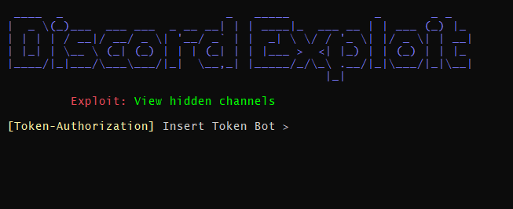
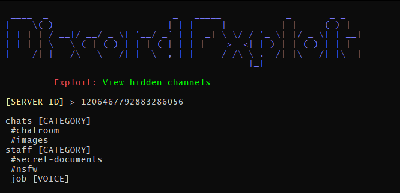

</a>

<h2 align="center">SHOW HIDDEN CHANNELS - DISCORD BUG</h2>

Within Discord, it is possible to make API queries (v6-v10) that allow you to view channels that, for technical reasons, would not be visible within the app itself. While this might be considered a bug, Discord currently treats it as non-private information. Below is a demonstration of a Python script that uses this API feature.

# Requeriments
- **Python 3**
- **Requests**
- **Token bot [(Discord Developer Portal)](https://discord.com/developers/applications/)**
 

- **Optionally, you can use your account's token, make sure to remove the "Bot" in line 63. [(How to obtain your account token)](https://gist.github.com/MarvNC/e601f3603df22f36ebd3102c501116c6)**

# Image and Test

#

